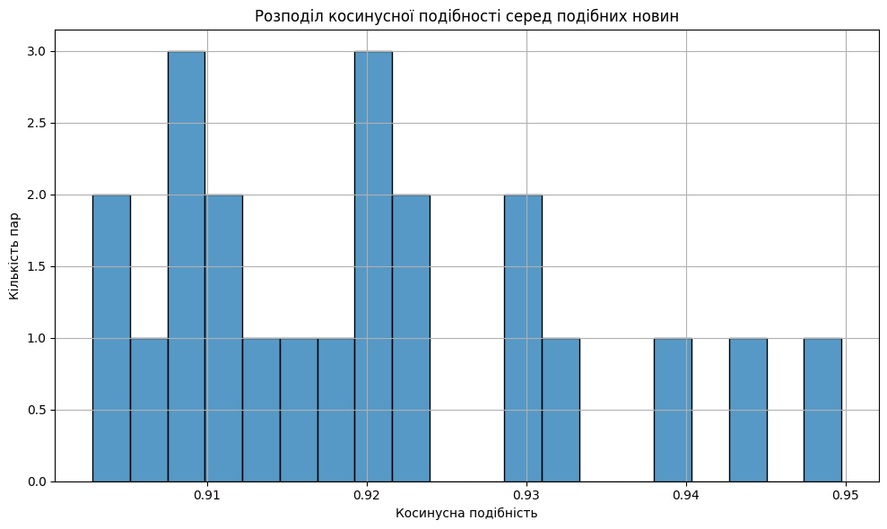
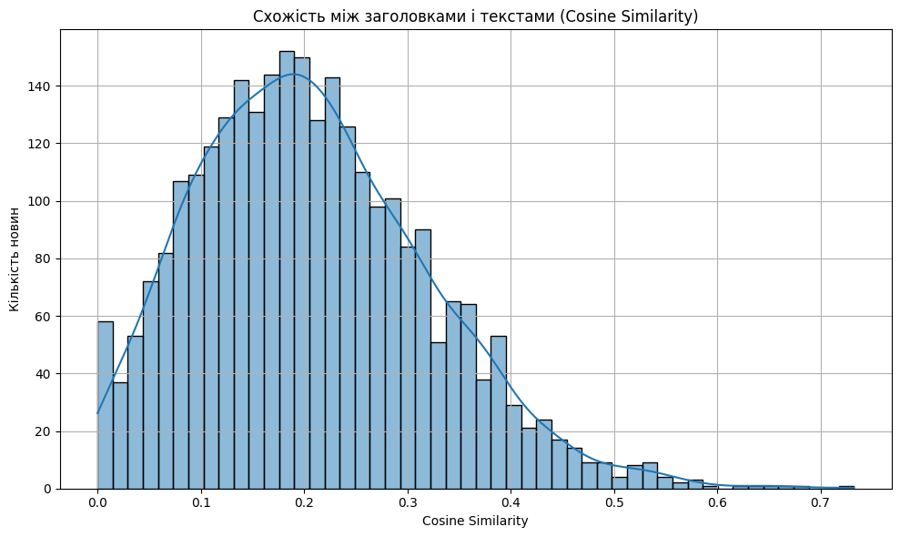
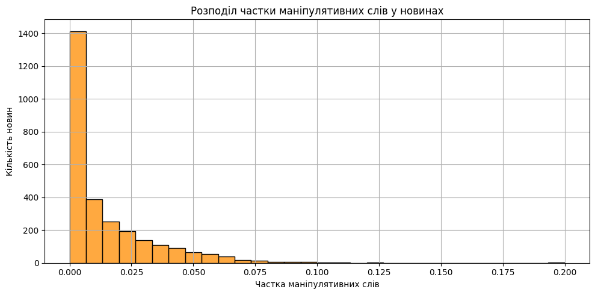

# Аналітичний звіт по новинам

**Дата створення:** 2025-05-28 09:05:56

**Проаналізовано новин:** 2796

**Період аналізу:** 2025-05-18 - 2025-05-27

**Середня тональність:** -0.16

## Частота публікацій
Цей графік відображає, як змінювалась кількість новин з часом. Піки можуть свідчити про події, що привернули велику увагу ЗМІ, тоді як провали — про інформаційне затишшя.

## Хмара слів
Хмара слів показує, які лексеми найчастіше зустрічались у текстах новин. Великі слова — часті, дрібні — рідкісні. Це дозволяє побачити основну тематику публікацій.

## Аналіз тональності
Тональність — це оцінка емоційного забарвлення тексту (негативна, нейтральна, позитивна). Розподіл показує загальну емоційну атмосферу в ЗМІ. Також аналіз подає, як змінювалась тональність із часом.

## Аналіз згадувань (NER)
Цей розділ показує, які іменовані сутності (особи, організації, географічні назви) згадуються найчастіше. Це дає змогу оцінити фокус ЗМІ на ключових фігурах і темах.

## Виявлення схожих новин
За допомогою векторизації та кластеризації виявлялись новини з дуже схожим текстом. Це дозволяє знайти копії новин, розміщені на різних сайтах або варіації одних і тих же повідомлень.

## Виявлення схожих новин (репаковані тексти)
Загалом знайдено 22 пар новин з косинусною подібністю понад 0.9.

Найбільш схожі пари:

- **Британія в останню мить заблокувала передачу архіпелагу з авіабазою Маврикію**
  ↔ **Британія передумала віддавати Маврикію архіпелаг Чагос з авіабазою** — подібність: 0.950
- **Злотий дешевшає до гривні другий день поспіль**
  ↔ **Курс польського злотого знову перевищив 11 гривень** — подібність: 0.943
- **Злотий різко подорожчав до гривні**
  ↔ **Курс польського злотого знову перевищив 11 гривень** — подібність: 0.939
- **Тепла не чекати? Яка погода буде в Україні наступного тижня**
  ↔ **Нарешті тепло? Чого чекати від погоди наступного тижня** — подібність: 0.931
- **Генштаб: Сили оборони України за добу знищили 58 російських артсистем і 5 бойових бронемашин**
  ↔ **Генштаб: Росія лишилася без 1 040 військових і 29 артсистем за добу** — подібність: 0.930
- **ЗСУ відбили на Покровському напрямку 20 атак, бої тривають, - Генштаб**
  ↔ **З початку доби відбулось 100 боїв – Генштаб** — подібність: 0.929
- **Курс польського злотого знову перевищив 11 гривень**
  ↔ **Польський злотий дорожчає до гривні другий день поспіль** — подібність: 0.924
- **Польський злотий дорожчає до гривні другий день поспіль**
  ↔ **Злотий подорожчав до гривні** — подібність: 0.924
- **Politico: Німецька компанія експортувала в Росію обмежені технології, попри санкції ЄС**
  ↔ **Німецька компанія в обхід санкцій постачала технології до РФ через Словенію, - Politico** — подібність: 0.921
- **Злотий різко подорожчав до гривні**
  ↔ **Злотий подешевшав до гривні після стрибка курсу** — подібність: 0.920
## Узгодженість заголовків і текстів
Цей аналіз вимірює схожість між заголовками та основним текстом новини. Низька схожість може свідчити про клікбейт або маніпуляцію. Показано як загальну картину, так і приклади сумнівних новин.

## Аналіз узгодженості заголовків і текстів
Гістограма показує, наскільки заголовки відображають зміст текстів.
Нижче наведено 10 новин із найменшою схожістю між заголовком і основним текстом — це потенційно клікбейт:

- **СюжетПо слідах Зеленського. Новий скандал у Білому домі** — схожість: 0.000
- **Ізраїль посилить охорону своїх посольств у всьому світі** — схожість: 0.000
- **В Bloomberg розкрили військові плани Путіна** — схожість: 0.000
- **Макрон отримав публічного ляпаса від дружини** — схожість: 0.000
- **Війна забрала життя українського чемпіона з марафонського бігу** — схожість: 0.000
- **Радіо Судного дня передало повідомлення перед розмовою Путіна та Трампа** — схожість: 0.000
- **Стало відомо, як відпрацювала ППО** — схожість: 0.000
- **Генштаб назвав втрати Росії на 22 травня** — схожість: 0.000
- **У кількох містах Іспанії відбулися масові протести проти туризму** — схожість: 0.000
- **ЗСУ стримують штурми: росіяни намагалися прорвати кордон Харківщини** — схожість: 0.000
## Маніпулятивна лексика в новинах
Оцінено частоту використання слів, які можуть вказувати на маніпулятивну риторику (емоційно забарвлені оцінки, тиск, узагальнення тощо). Це дає змогу виявити публікації з потенційно навмисним впливом на читача.

## Аналіз маніпулятивної лексики
Загальна кількість слів у словнику: 210.

Оцінено частку маніпулятивних лем у кожній новині. Нижче — заголовки з найбільшої кількістю співпадінь:

- **Генштаб назвав втрати Росії на 22 травня** — 3 маніпулятивних слів (20.00%)
- **ЗСУ знищили російський ЗРК Бук-М3 вартістю $45 млн** — 1 маніпулятивних слів (12.50%)
- **Росіяни атакували Херсон: багато поранених** — 1 маніпулятивних слів (11.11%)
- **У Харкові прогримів вибух** — 3 маніпулятивних слів (10.34%)
- **Вибухи пролунали у Запорізькій області** — 10 маніпулятивних слів (10.31%)
- **Шахеди долетіли до західних областей** — 9 маніпулятивних слів (10.11%)
- **Росіяни розстріляли двох полонених бійців на Покровському напрямку** — 10 маніпулятивних слів (9.80%)
- **Київ та Харків під атакою БПЛА** — 10 маніпулятивних слів (9.52%)
- **У Запорізькій області пролунали вибухи, повідомлялося про загрозу балістики** — 16 маніпулятивних слів (9.41%)
- **Атака на Київ: палає багатоповерхівка** — 9 маніпулятивних слів (9.38%)
