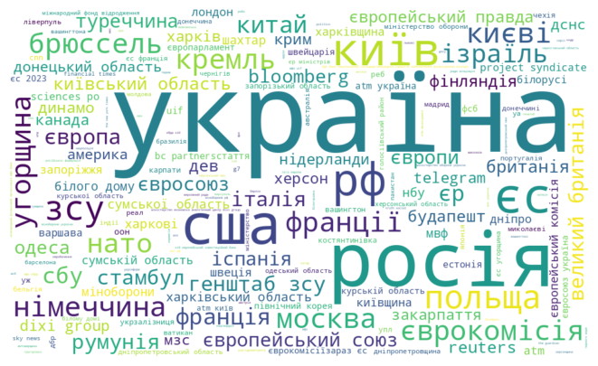

# Аналітичний звіт по новинам

**Дата створення:** 2025-01-09 19:04:52

**Проаналізовано новин:** 1308

**Період аналізу:** 2025-01-05 - 2025-01-09

**Середня тональність:** -0.08

## Частота публікацій
Аналіз розподілу публікацій за часом:

## Хмара слів
Найчастіше вживані слова:

## Тематичний аналіз (LDA)
Основні теми:

- **Тема 1:** 0.017*"трамп" + 0.015*"сша" + 0.010*"президент" + 0.009*"канада" + 0.006*"штат"
- **Тема 2:** 0.006*"од" + 0.005*"фільм" + 0.004*"найкращий" + 0.004*"україна" + 0.003*"стати"
- **Тема 3:** 0.024*"напрямок" + 0.013*"російський" + 0.011*"район" + 0.011*"область" + 0.011*"україна"
- **Тема 4:** 0.019*"гривня" + 0.018*"долар" + 0.018*"1" + 0.014*"млрд" + 0.011*"україна"
- **Тема 5:** 0.023*"україна" + 0.008*"газ" + 0.007*"росія" + 0.006*"країна" + 0.005*"січень"
- **Тема 6:** 0.018*"україна" + 0.006*"військовий" + 0.006*"служба" + 0.005*"державний" + 0.005*"особа"
- **Тема 7:** 0.017*"україна" + 0.010*"січень" + 0.007*"російський" + 0.007*"сила" + 0.006*"повітряний"
- **Тема 8:** 0.034*"україна" + 0.010*"росія" + 0.009*"війна" + 0.008*"трамп" + 0.007*"сша"
- **Тема 9:** 0.019*"україна" + 0.014*"російський" + 0.009*"область" + 0.009*"повідомити" + 0.008*"росія"
- **Тема 10:** 0.018*"україна" + 0.011*"область" + 0.007*"січень" + 0.005*"повідомляти" + 0.004*"5"

## Аналіз тональності
Розподіл емоційного забарвлення:

Розподіл тональності за часом:

## Аналіз згадувань (NER)
Частота згадування ключових осіб та організацій:

